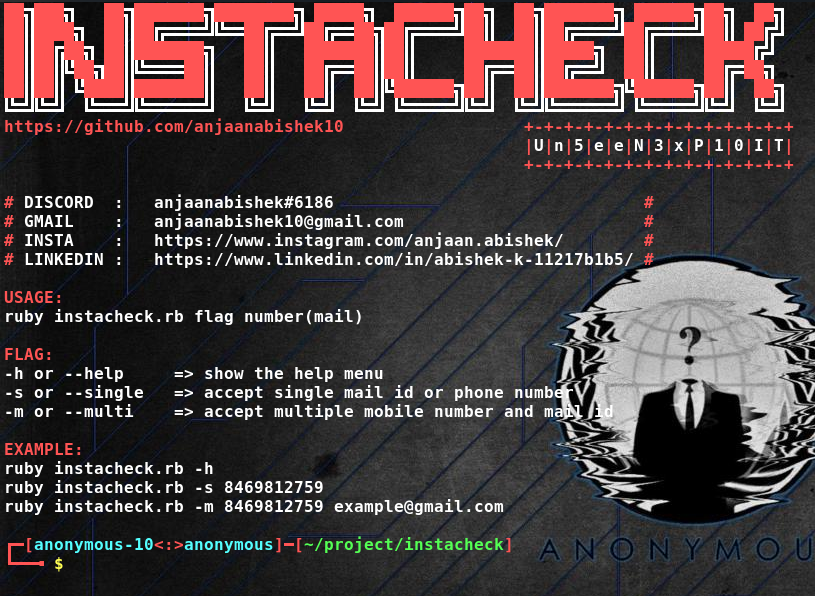
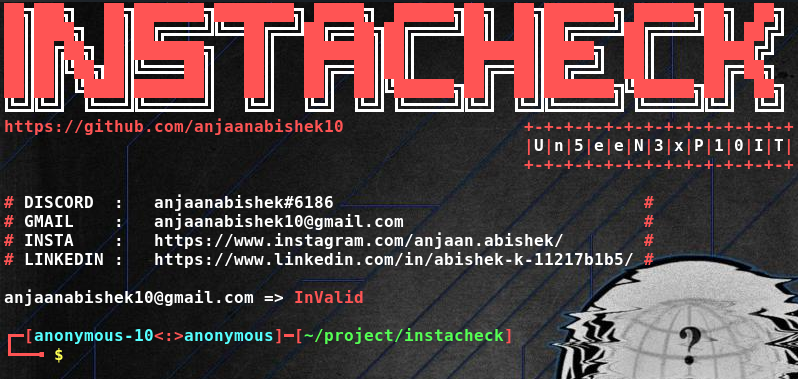
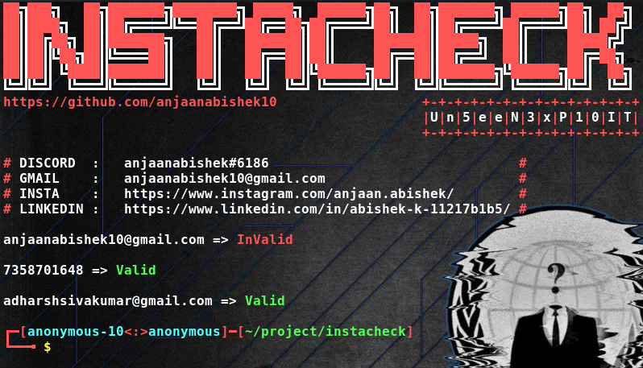

# InstaCheck

Check any mail or number, if it's conneted to Instagram

[][mail]
[][linkedin]
[][instagram]
[][facebook]
 anjaanabishek#6186

<h2> Get Started: </h2>

* sudo apt install ruby-full

* sudo apt install git

* git clone https://github.com/anjaanabishek10/InstaCheck.git

* cd InstaCheck

<h2> Usage: </h2>

<h3> => ruby instacheck.rb -h </h3>

<h3> => ruby instacheck.rb -s anjaanabishek10@gmail.com </h3>

<h3> => ruby instacheck.rb -m adharshsivakumar@gmail.com anjaanabishek10@gmail.com 7358701648 </h3>

[mail]: mailto:anjaanabishek10@gmail.com
[linkedin]: https://www.linkedin.com/in/abishek-k-11217b1b5/
[instagram]: https://www.instagram.com/anjaan.abishek/
[facebook]: https://www.facebook.com/anjaan.abishek.10/
